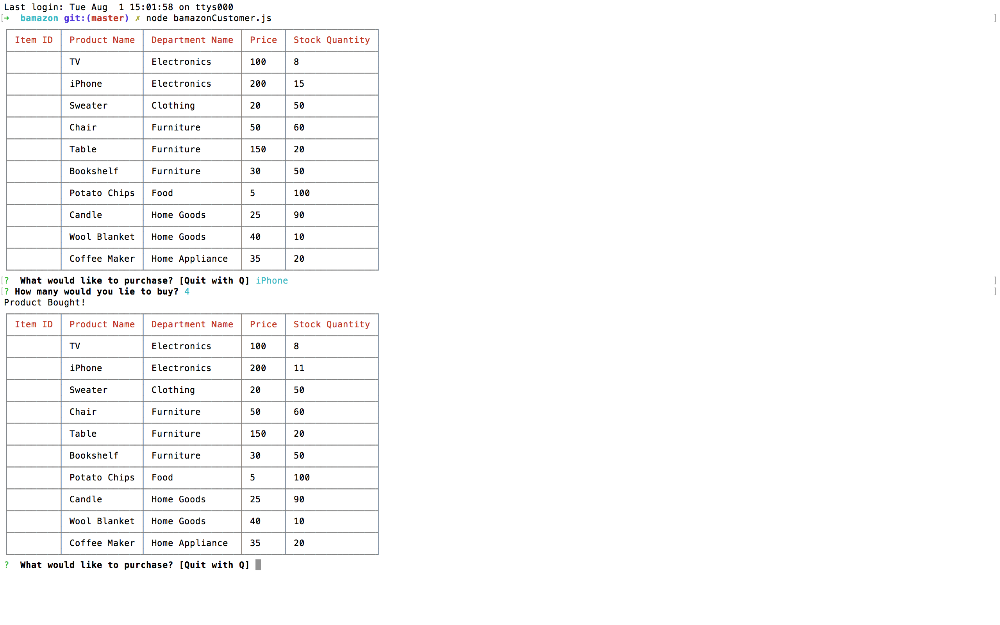
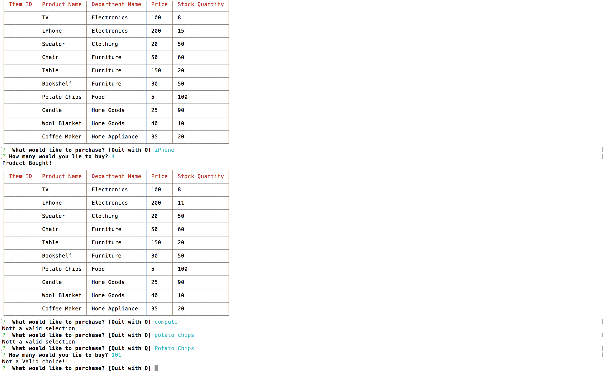

# Bamazon

**OVERVIEW** 

This application utilizes a Sequel Pro database called Bamazon to help customers make purchases from the in-stock inventory. Bamazon contains a table named Products, and columns: Item ID, Product Name, Department Name, Price, and Stock Quantity.

This app is the Customer View application. 

**FUNCTIONALITY**  

The customer app will load the table and display all items for sale and the coresponding data for each item. You'll then be prompted for product name and desired quantity. Enter this to start the application : node bamazonCustomer.js

The application will also know if the item does not exist or if the quanity requested is less than number in-stock.

